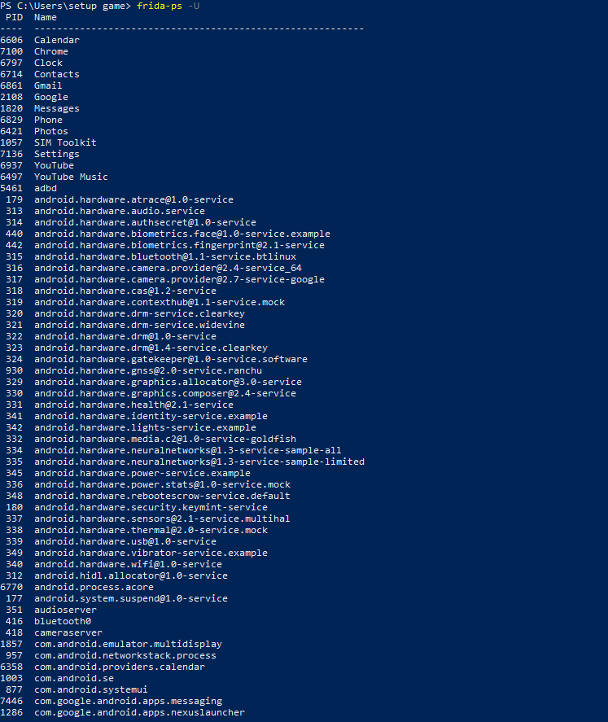
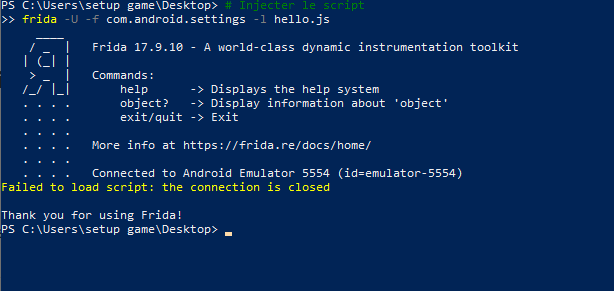
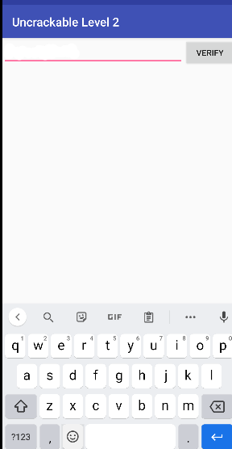

# Lab — Contournement de la détection Root Android avec Frida

## 📌 Présentation

Ce laboratoire a pour objectif de comprendre comment les applications Android détectent un appareil rooté et comment neutraliser ces mécanismes de détection dans un environnement de test contrôlé à l’aide de Frida.

L’analyse reste strictement pédagogique et défensive. Le but est d’observer les techniques de sécurité des applications mobiles et de vérifier leur comportement face à l’instrumentation dynamique.

---

## 🎯 Objectifs pédagogiques

À la fin de ce laboratoire, l’apprenant sera capable de :

- Comprendre comment les applications Android détectent le root
- Utiliser Frida pour hooker des fonctions Java et natives
- Bypasser des mécanismes de root detection
- Vérifier le contournement en conditions réelles
- Diagnostiquer les problèmes liés à Frida

---

## ⚖️ Cadre légal et éthique

Ce laboratoire doit être réalisé uniquement sur des applications et appareils autorisés.

### Autorisé

- Émulateur personnel
- Application de test
- APK pédagogique
- Appareil de laboratoire

### Interdit

- Utilisation sur applications réelles sans autorisation
- Bypass sur appareils tiers
- Tests offensifs
- Contournement sur systèmes non autorisés

---

## 🧰 Prérequis

- Python installé
- Frida installé sur la machine hôte
- frida-server sur Android
- ADB fonctionnel
- Émulateur Android ou appareil rooté
- APK de test avec root detection

### Vérification

```bash
frida --version
adb devices
frida-ps -Uai
```

---

## 🛠 Outils utilisés

### Frida

Utilisé pour :

- intercepter les appels Java
- hooker les fonctions natives
- modifier le comportement runtime
- neutraliser root detection
- observer les appels système

### ADB

Utilisé pour :

- connecter l’appareil Android
- transférer frida-server
- lancer le serveur Frida
- forward des ports

---

## 🔄 Workflow

```text
Préparation environnement
        ↓
Installation frida-server
        ↓
Connexion appareil
        ↓
Analyse root detection
        ↓
Hook Java
        ↓
Hook natif
        ↓
Validation bypass
        ↓
Documentation
```

---

## 🧪 Étapes du laboratoire

### 1. Préparation de l’environnement

- Lancer l’émulateur Android
- Installer l’application cible
- Démarrer frida-server
- Vérifier la connexion

### 2. Identification du package

Lister les applications :

```bash
frida-ps -Uai
```

### 3. Création des scripts Frida

Créer :

- `bypass_root.js`
- `bypass_native.js`

Ces scripts permettent de :

- falsifier `Build.TAGS`
- masquer `su`
- intercepter `File.exists()`
- bloquer `Runtime.exec()`
- neutraliser `open`, `stat`, `access`

### 4. Lancement

```bash
frida -U -f com.example.rootcheck -l bypass_root.js --no-pause
```

Ou avec hooks natifs :

```bash
frida -U -f com.example.rootcheck -l bypass_root.js -l bypass_native.js --no-pause
```

---

## 🔐 Techniques observées

### Java

- Build.TAGS
- File.exists()
- Runtime.exec()
- RootBeer
- recherche de su
- busybox

### Natif

- open()
- openat()
- access()
- stat()
- lstat()
- /proc/mounts

---

## 📚 Références

Ce lab s’appuie sur :

- OWASP
- OWASP MASVS
- OWASP MASTG
- Frida Documentation

Catégories :

- MASVS-RESILIENCE
- MASVS-CODE
- MASVS-PLATFORM
- MASVS-TESTING

---

# 📷 Screenshots











